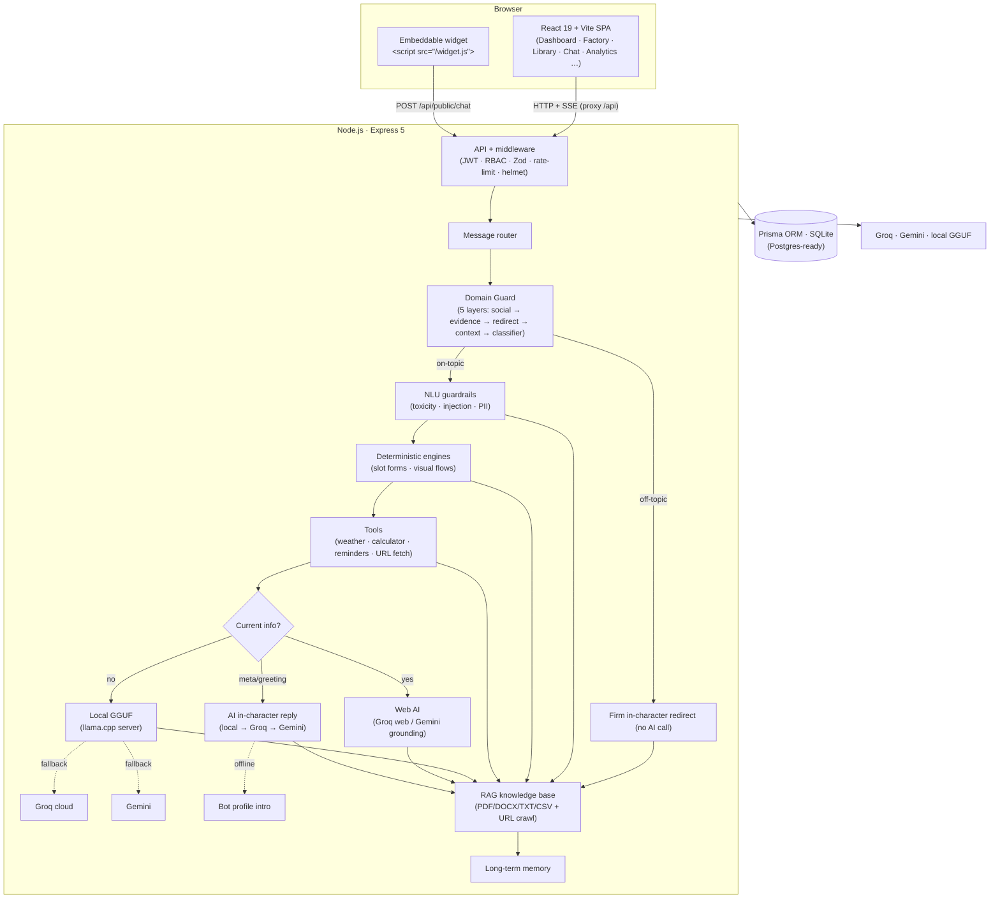

# Scarlet — Chatbot Factory

**One application that procedurally manufactures any number of domain-specialized chatbots — from a single bot to thousands — all sharing a single frontend, backend, SQLite database, and one local AI model (with optional cloud AI for current-information questions).**

Every generated bot is genuinely different: its own domain and specialty, personality, system prompt, guardrails, starter questions, welcome message, and a full visual "Design DNA" (theme, layout, message style, background, avatar shape, corner radius, glow, heading font). A bot's domain is a **behavioral constraint**, not just a label — each bot politely refuses questions outside its specialty via a 5‑layer Domain Guard.

---

## Features

| Area | What Scarlet does |
|------|-------------------|
| **Procedural generation** | Generate 1–5000 domain‑specialized bots in one bulk database transaction. |
| **Custom bot creator** | Describe any bot in plain English — AI designs the name, personality, prompts, theme, and starters; regenerate any part until it feels right. |
| **Domain Guard** | A 5‑layer relevance check (greetings → evidence → redirect → context → LLM classifier) keeps each bot on‑topic with an explainability panel. Also catches "Who is Donald Trump?" _proper‑noun_ questions with zero vocabulary overlap. |
| **Conversation handling** | Instructions injected into every prompt so personal experiences ("I got my sweet tooth at 8") are interpreted warmly instead of "you meant X". |
| **Hybrid AI routing** | Normal questions → local GGUF model; current‑info questions → web‑enabled cloud AI; every provider down still degrades gracefully. |
| **RAG knowledge base** | Upload PDF / DOCX / TXT / CSV / JSON or crawl a URL — the bot answers with cited sources. |
| **SSE token streaming** | Animated cursor, graceful non‑streaming fallback. |
| **Voice input** | Speak your message via the Web Speech API (mic button in the composer). |
| **Text‑to‑speech** | Listen to any reply read aloud (female English voice, or Google Translate TTS for Tamil/Hindi/Telugu/Kannada/Malayalam/Japanese — via a same‑origin backend proxy). |
| **Live model comparison** | Ask one question; see Local, Groq and Gemini answer side by side. |
| **Multi‑language translate** | Translate any bot reply into தமிழ், తెలుగు, हिन्दी, മലയാളം, ಕನ್ನಡ, 日本語, or English (requires a Groq or Gemini key). |
| **Sentiment analytics** | 7‑day conversation sentiment trend chart (lexicon‑based, offline, deterministic). |
| **Emoji spam cleanup** | Display‑time emoji collapse for old stored messages; backend‑side cleaning for new ones. |
| **Response cleaning** | Small local models often ramble in multi‑turn loops — the response cleaner cuts at the first turn boundary and collapses emoji. |
| **Auth & multi‑tenancy** | JWT with refresh rotation, RBAC, isolated workspaces, invite codes, usage quotas with 80% warn / 100% block. |
| **Analytics** | Recharts dashboards with live 5s polling, CSV / SVG export (provider donut, domain dist, response‑time histogram, conversation length, heatmap, CSAT, sentiment). |
| **NLU & guardrails** | Intent, sentiment, language, PII redaction, toxicity, prompt‑injection blocking, moderation dashboard. |
| **Human‑in‑the‑loop** | Agent queue, AI co‑pilot suggestions, canned responses, internal notes. |
| **Embeddable widget** | One `<script>` tag puts any bot on any website. |
| **Bot builder** | Prompt editor, personality traits, appearance colors (live preview), guard strictness, memory toggle, slot forms, visual flow builder, version history + rollback. |
| **Conversation management** | Stream, regenerate, edit‑and‑fork, pin, thumb up/down, share link, export (MD / JSON / CSV / TXT / PDF), summarize (right‑side panel with copy button). |
| **Security hardening** | Helmet headers, CORS allowlist, rate limiting, Zod validation, central error handler. |
| **Docker** | `docker compose -f docker/docker-compose.yml up` — backend + frontend + optional local LLM. |

---

## Architecture



### How a message is handled

```
user message + history + bot profile
        │
        ▼
   DOMAIN GUARD ──(off-topic)──► polite redirect (no AI call)
        │ (on-topic)
        ▼
   needs current info?
    ├─ no  ──► LOCAL model  ──(if down)──► Groq → Gemini
    └─ yes ──► Groq web     ──(if down)──► Gemini → local
        │
        ▼
   answer + provider label (Local AI / Cloud AI / Web-enhanced / Domain Guard)
        │
        ▼
   persisted to SQLite
```

### Domain Guard (5 layers)

| Layer | What it does | Result |
|-------|-------------|--------|
| **0 Social** | "Hi!", "What can you do?" → answered from profile instantly (no AI cost, or AI in‑character if a provider is available). | Greeting / meta |
| **1 Own‑field evidence** | The question matches the bot's own vocabulary (allowed topics, lexicons, synonyms, semantic relationships). | IN_DOMAIN |
| **1b Proper‑noun** | "Who is Donald Trump?" on a dental bot — capitalised name with no connection to the field → redirect. | OUT_OF_DOMAIN |
| **2 Foreign‑field evidence** | The question matches another domain's vocabulary → redirect (when no LLM classifier is available). | OUT_OF_DOMAIN |
| **3 Context follow‑up** | The previous exchange was on‑topic → allow (prevents false redirects for abbreviations). | FOLLOW_UP |
| **4 LLM classifier** | Groq or Gemini decides. | YES / NO |
| **5 Default allow** | Everything else → let the LLM answer (the system prompt keeps it on‑topic). | DEFAULT |

---

## Prerequisites

- **Node.js 18+** (for the frontend and backend)
- **Python 3.9+** (only if you want the local model; optional)
- The local model file at `models/llm-model.gguf` (optional — cloud AI is used if absent)
- **Groq API key** (optional but recommended) — get one free at https://console.groq.com/keys
- **Gemini API key** (optional) — get one at https://aistudio.google.com/apikey

---

## Quick start (Windows, one click)

```bat
npm install        # first time only
start_all.bat
```

This opens three windows — the local LLM server, the backend API, and the frontend. When the **frontend** window prints a `Local:` URL (usually `http://localhost:5173`), open it in your browser.

> **Fresh clone?** The SQLite database is git-ignored. Run `npm run prisma:migrate` once before the first start to create it (see Manual start below).

---

## Manual start (any OS, three terminals)

### 1. Install dependencies

```bash
npm install
```

### 2. Create the database

```bash
npm run prisma:migrate      # applies prisma/migrations (SQLite file in data/)
```

### 3. Configure environment

```bash
copy .env.example .env      # Windows   (cp .env.example .env on macOS/Linux)
```

Edit `.env` — at minimum add your **Groq** or **Gemini** key if you want cloud AI. The app works without any keys (local model + profile answers), but with a key it becomes much smarter and gains translation, web search, and vision.

### 4. (Optional) Start the local LLM model server

```bash
install_deps.bat      # first time only, sets up the Python venv
start_llm.bat         # serves models/llm-model.gguf on port 8000
```

### 5. Start the backend

```bash
npm run server         # Express + Prisma on port 3001
```

### 6. Start the frontend

```bash
npm run dev            # Vite dev server on port 5173
```

Then open **http://localhost:5173** — the login page appears. Use the default credentials:

- Email: `admin@factory.local`
- Password: `admin123`

---

## Docker (one command)

```bash
copy .env.example .env          # Windows  (cp on macOS/Linux)
docker compose -f docker/docker-compose.yml up --build
```

Then open **http://localhost:5173**.

| Service | Container port | Host port | Notes |
|---------|---------------|-----------|-------|
| `frontend` | 80 | 5173 | nginx serving the built React app; proxies `/api`, `/widget.js` to the backend |
| `backend` | 3001 | 3001 | Express + Prisma; the SQLite file persists in `./data` |
| `llm` *(optional)* | 8000 | 8000 | local GGUF model — enable with `--profile llm` and place `models/llm-model.gguf` |

```bash
# With the local model (first time: put models/llm-model.gguf in ./models)
docker compose -f docker/docker-compose.yml --profile llm up --build
```

Without the `llm` service the app still works: greetings/profile replies, the Domain Guard, and (if you add `GROQ_API_KEY` / `GEMINI_API_KEY` to `.env`) cloud AI all function normally.

---

## Configuration

Copy `.env.example` to `.env` and fill in your keys. The most important variables:

| Variable | Default | Purpose |
|----------|---------|---------|
| `AI_PROVIDER` | `auto` | Routing mode: `auto` (recommended), `local`, `groq`, or `gemini` |
| `GROQ_API_KEY` | — | Enables cloud AI, web search, translation, and model comparison |
| `GEMINI_API_KEY` | — | Secondary cloud provider + vision (Gemini is used only if Groq is unavailable) |
| `GROQ_CHAT_MODEL` | `openai/gpt-oss-20b` | Groq model for chat + translation (this is a reasoning model — see note below) |
| `GROQ_WEB_MODEL` | `openai/gpt-oss-20b` | Groq model for web-enhanced (current‑info) queries |
| `GEMINI_MODEL` | `gemini-3.6-flash` | Gemini model for chat + vision |
| `PORT` | `3001` | Backend port |
| `LOCAL_LLM_URL` | `http://127.0.0.1:8000/api/chat` | Where the Python model server listens |
| `DATABASE_URL` | `file:../data/chatbot_factory.db` | SQLite file for Prisma (relative to `prisma/schema.prisma`) |
| `CORS_ORIGINS` | — | Comma‑separated origins allowed to call the API cross‑origin |
| `JWT_SECRET` | `dev-secret-change-me-in-production` | Signs access/refresh tokens — **change for production** |
| `BOOTSTRAP_ADMIN_EMAIL` | `admin@factory.local` | First‑run admin account email |
| `BOOTSTRAP_ADMIN_PASSWORD` | `admin123` | First‑run admin account password |

> **Note on `openai/gpt-oss-20b`:** this is a **reasoning model** — it spends some tokens on "thinking" before the answer. All Groq calls therefore use a 2000‑token budget (instead of the usual 900) so the actual answer always fits.

**.env** holds live secrets and is git-ignored. Keys are read only by the backend — they are never sent to the browser. Do not commit `.env` or the `data/` folder.

---

## Chat features

### Composer
- **Mic** — speak your message (Web Speech API, Chrome/Edge recommended)
- **Paperclip** — upload a document (PDF / DOCX / TXT / CSV / JSON) to the bot's knowledge base
- **Enter** to send, **Shift+Enter** for a new line

### Message actions (hover toolbar)
- **Copy** — copy the message text
- **Pin** — pin / unpin a message
- **Edit** (user messages only) — fork the conversation at this point
- **Speaker** — read the message aloud (female English voice; translated text uses Google Translate TTS)
- **Translate** — translate the message into தமிழ், తెలుగు, हिन्दी, മലയാളം, ಕನ್ನಡ, 日本語 or English (requires a Groq or Gemini key)
- **👍 / 👎** — rate the response

### Header actions
- **Compare** — ask the same question to Local, Groq and Gemini side by side (with a 60s timeout)
- **Summarize** — opens a right‑side panel with a full conversation summary (copy button included)
- **Share** — copy a public share link
- **Export** — download the conversation as MD / JSON / CSV / TXT / PDF
- **Edit** — open the bot builder
- **Knowledge** — open the bot's knowledge base (RAG)

### Streaming
Every chat response streams token‑by‑token (SSE) with an animated cursor. If the streaming provider is unavailable, a non‑streaming fallback is used. The server is the single source of truth — every reply is reloaded from the database after completion, so no messages are ever lost.

---

## Additional features

### Domain Guard redirect message
When the guard detects an off‑topic question, the bot replies with a **firm, in‑character redirect** that includes its domain, specialty, and example topics. "Who is Donald Trump?" on a dental bot:
> "I'm a **Healthcare · Dental** assistant, so I only answer Healthcare‑related questions. 'Who is Donald Trump?' is outside my specialty — I'd rather be honest than guess. Please ask me only Healthcare questions, like dental, teeth, tooth, gum, gums. I'll go as deep as you want!"

### Voice input
Uses the **Web Speech API** (`webkitSpeechRecognition`). Supported in Chrome, Edge, and Safari. The mic button in the composer turns red when listening.

### Text‑to‑speech
- **English** → a young female browser voice (Samantha, Zira, Google US English, etc.)
- **Tamil / Hindi / Telugu / Kannada / Malayalam / Japanese** → **Google Translate TTS** (pronunciation is correct; the audio is proxied through our backend at `/api/tts` to avoid cross‑origin blocking)
- Long messages are split into ≤180‑character chunks played in sequence
- A floating **"Stop reading"** button appears while speech is active
- Auto‑stops when you send a new message

### Translation
Translate any bot reply into 7 languages. Requires a **working Groq or Gemini API key** — the tiny local GGUF model cannot translate reliably. The translation is validated: emoji‑only or untranslated outputs are rejected and the next provider is tried. The Groq fallback chain tries multiple model names if the configured one 404s.

### Model comparison
Click **Compare** in the chat header. The current input (or the last user message) is sent to Local, Groq, and Gemini in parallel. The first to respond wins. Each column shows the provider name and the full answer. A 60‑second timeout prevents hanging.

### Summary drawer
Click **Summarize** → a right‑side panel slides in, showing the full conversation condensed (AI‑generated when available, heuristic fallback offline). The summary is cached per conversation and includes a **Copy** button.

---

## Project structure

```
root/
├── src/                     React 19 + Vite + TypeScript
│   ├── pages/               Dashboard, Factory, Library, Chat, Auth, Settings,
│   │                        OrgSettings, KB, Analytics, Moderation, Agent,
│   │                        Templates, BotEditor, FlowBuilder, WidgetConfig,
│   │                        Search, Share, CustomBotView, RandomBotView
│   ├── components/          ui/ (Button, Modal, Drawer, Card, Skeleton, Confetti…)
│   │                        layout/ (AppShell, Sidebar, TopBar), CommandPalette,
│   │                        CustomBotCreator, OnboardingTour, ShortcutsOverlay
│   ├── auth/                AuthContext, token storage
│   ├── services/db.ts       typed API client (auth headers, auto-refresh)
│   └── utils/               botName, theme, seenBots
├── backend/
│   ├── app.js               Express app factory (importable for tests)
│   ├── server.js            entry point — bootstrap + listen
│   ├── routes/              health, auth, orgs, bots, customBot, templates,
│   │                        handoff, conversations, intelligence, search, share,
│   │                        rag, analytics, moderation, public, widget, chat
│   ├── services/            generator, domainGuard, llmService, currentInfo,
│   │                        auth, org, audit, bot, conversation, chat, customBot,
│   │                        builder, engines, nlu, tools, agent, rag, analytics,
│   │                        share, intelligence, templates
│   ├── middleware/          validate (Zod), rateLimits, errorHandler, auth (JWT/RBAC)
│   ├── db.js                data-access layer on Prisma (camelCase contract)
│   ├── domainLexicon.js     shared vocabulary for every domain (applies to all bots)
│   ├── domainData.js        combined 47‑domain, 433‑specialty knowledge base
│   ├── domainPart*.js       individual domain part files
│   └── loadEnv.js           loads .env before any module is evaluated
├── prisma/
│   ├── schema.prisma        14‑model enterprise schema (SQLite default)
│   └── migrations/          versioned migration history
├── docker/                  Dockerfile.backend, Dockerfile.frontend,
│   │                        Dockerfile.llm, docker-compose.yml, nginx.conf
├── docs/
│   ├── architecture.md      stack diagram + decisions + demo flow
│   ├── DEMO_SCRIPT.md       5‑minute walkthrough for demo day
│   └── PRESENTATION.md      ready-to-follow presentation guide
├── tests/
│   ├── unit/                vitest (NLU, guardrails, generator, translation)
│   ├── integration/         supertest against an isolated test DB
│   ├── verify_domain.mjs    211 domain‑guard acceptance tests
│   └── sweep_domain.mjs     random‑sample quality sweep
├── widget/                  (served by backend: /widget.js + /widget/:botId)
├── scripts/                 migrate-legacy-data.mjs, seed-demo.mjs
├── data/                    SQLite database (created at runtime, git-ignored)
├── run_llm.py               Python server for the local GGUF model
├── Modelfile                GGUF model configuration
├── requirements.txt         Python dependencies (llama-cpp-python)
├── start_all.bat            Windows one‑click launch
├── install_deps.bat         Python venv setup
└── start_llm.bat            Python model server launcher
```

---

## Testing

```bash
# Full suite (unit + integration)
npm test

# Unit tests only (47 tests — NLU, guardrails, generator, translation validation)
npm run test:unit

# Domain Guard acceptance tests (211 assertions)
npm run test:domain

# Random quality sweep (accepts 0% own‑question refusal)
npm run test:sweep

# Coverage report
npm run test:coverage
```

The **domain guard tests** (`verify_domain.mjs`) are the most important: they verify that every bot correctly answers on‑topic questions, politely redirects off‑topic ones, and handles greetings/meta/form/slot queries. The **sweep** (`sweep_domain.mjs`) randomly generates 60+ specialties and checks that no bot ever refuses its own starter questions.

---

## Troubleshooting

| Symptom | Likely cause | Fix |
|---------|-------------|-----|
| "Could not reach the factory backend" | Backend isn't running | `npm run server` (port 3001) |
| "Internal server error" on translate | Backend hasn't been restarted after route changes | Stop (`Ctrl+C`) and restart `npm run server` |
| "Translation needs a working Groq or Gemini key" | The local model can't translate; the cloud key isn't working | Add a valid `GROQ_API_KEY` or `GEMINI_API_KEY` to `.env` |
| "Speech unavailable" when clicking Listen | Google TTS endpoint is blocked on your network | Try Edge or Chrome; check Windows Speech language packs |
| Compare shows only one provider | Only that provider's key is configured | Add the missing keys to `.env` |
| Answers say "Local model was unavailable" | Python server on port 8000 isn't up | Run `start_llm.bat`, or set a `GROQ_API_KEY` so cloud AI answers instead |
| Bots don't appear after generating | Backend window shows an error, or `data/` is unwritable | Check the backend console; confirm the SQLite database is created |
| Port already in use | Another process is using the port | Change `PORT` in `.env` (backend) or run `npm run dev -- --port 5174` |
| "New" badge never clears | The badge is purely time‑based (24h) | It now clears after you visit the bot — refresh the browser |
| Emoji overload in old messages | Older messages were stored before the cleaner existed | Display‑time cleanup is now applied; new messages are cleaned server‑side |

---

## FAQ (for newbies)

**Q: What makes this different from just calling ChatGPT?**
A: Procedural generation at scale, domain safety with explainability, RAG with citations, deterministic engines, hybrid provider routing, and full multi‑tenant product features around it — all sharing one local model.

**Q: How does the bot know what's off‑topic?**
A: A 5‑layer Domain Guard: social → own‑field evidence → foreign‑field redirect → context → LLM classifier. A proper‑noun detection layer catches person questions ("Who is Donald Trump?") with zero keyword overlap.

**Q: What happens if the local model is off?**
A: Greetings answer from the profile instantly; the Domain Guard still redirects off‑topic questions; deterministic fallbacks work; and cloud AI (Groq/Gemini) answers real questions if configured.

**Q: Is it one model for every bot?**
A: Yes — the same local GGUF, but each bot has a unique system prompt + domain profile, so they behave as distinct experts.

**Q: Why SQLite?**
A: Zero‑config for demo and development. The Prisma schema is provider‑portable — switching to PostgreSQL means changing the datasource provider and `DATABASE_URL`, then re‑migrating.

**Q: Where do the answers come from in the Compare view?**
A: Local GGUF, Groq (`openai/gpt-oss-20b`), and Gemini — the same router that serves chat, run side by side.

**Q: Can I deploy this to a real server?**
A: Yes. Switch to PostgreSQL (change `DATABASE_URL` in `.env`), set a strong `JWT_SECRET`, configure `CORS_ORIGINS`, and run with `npm run build && npm run server` (or use the Docker compose stack).

---

## Credits

Built for the **Chatbot Factory** evaluation project. The Domain Guard, 47‑domain knowledge base, hybrid routing, and response cleaning are the core original contributions. The project uses React, Express, Prisma, and llama‑cpp‑python as its foundation.

See `docs/DEMO_SCRIPT.md` for a ready‑to‑follow 5‑minute walkthrough, `docs/PRESENTATION.md` for a presentation guide, and `docs/architecture.md` for the full architecture breakdown.
